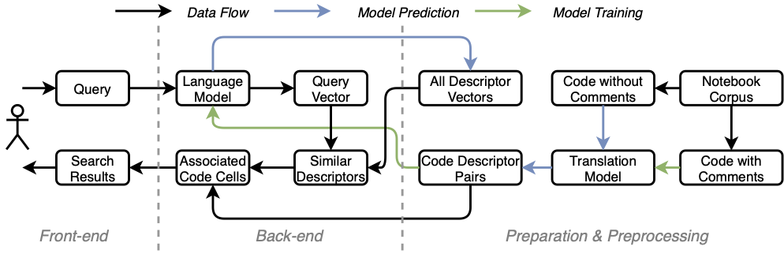

# NBSearch

*NBSearch* is a system that supports semantic code search in Jupyter Notebook collections and interactive visual exploration of search results. Details about the system can be found in the following publication:

>Xingjun Li, Yuanxin Wang, Hong Wang, Yang Wang, and Jian Zhao. [NBSearch: Semantic Search and Visual Exploration ofComputational Notebooks.](https://www.jeffjianzhao.com/papers/nbsearch.pdf) In Proceedings of the ACM SIGCHI Conference on Human Factors in Computing Systems, 2021.

A video demo of NBSearch can be viewed [here](https://youtu.be/wNSbivrYc0Y).

This repo corresponds to building the backend search engine of NBSearch. This code is contributed by Yuanxin Wang and Xingjun Li. `end2end/` includes the Python code for training and testing the models for the search engine. `data/` contains some of the pretrained models.

The above figure illustrates the architecture of the backend search engine. From a notebook corpus, code cells were extracted and split into two sets: code with comments and code without comments. From the code cell with comments, a seq2seq translation model (e.g., LSTM) was trained to "translate" code scripts into corresponding comments, which we call text descriptors of the code. With the trained translation model, a completed database of code-descriptor pairs of all the code cells in the corpus was generated by running the model on the code cells without comments.Then, all the text descriptors were sent to a language model (e.g., Doc2Vec) to learn a semantic vector space of these texts. Thus, each of the descriptors could be represented by a numerical vector, stored in a database of descriptor vectors, where more similar descriptors have a closer distance in the vector space.

With these trained models and generated databases, NBSearch is able to handle a user’s query and perform a semantic search of code in the notebook corpus. When a user initiates a query in natural language on the search bar of the front-end interface, the back-end leverages the language model to convert this query into its vector form. Then, it uses this query vector to search in the formerly generated database of descriptor vectors and retrieve similar descriptors. Based on these descriptors, the system further looks up in the database of code-descriptor pairs to obtain the associated code cells. After, these code cells, along with other useful information (e.g., which notebooks they belong to, other cells within the same notebooks, variables/functions used in code), are sent to the front-end for search result presentation.

## Dataset

A notebook collection can be downloaded from the [UCSD repository](https://library.ucsd.edu/dc/object/bb2733859v). The dataset needs to be placed in `data/`.

## Training Process

The raw Jupyter Notebooks should be in `data/notebooks` after extracting from the UCSD dataset. Go to `end2end/` and follow the below procedure to train and test the translation and language models for the semantic search engine.

### Create Environment

conda env create -f environment.yml

### Run

python main.py

### Preprocess Text

preprocessing('/data_path')

### Train and Test Models

model = Seq2SeqModel(model_option='lstm')

model.create_model()

model.train_model(batch_size=120, epochs=30)

model.evaluate_model(nums=100)

### Predict Comments from Code

model.predict_seq2seq_model(filename='/data/final_comments.csv')

* options of model name are 'gru', 'lstm', 'bilstm', 'lstmattention'

* default model.evaluate_model() will test all data from the testing file generated by preprocess

### Make Data Ready for the Front-end(Markdown Version).

Run notebook `end2end/generate_markdown.ipynb`.
Front-end(markdown version) is requesting directory `resource` generated from this step.
